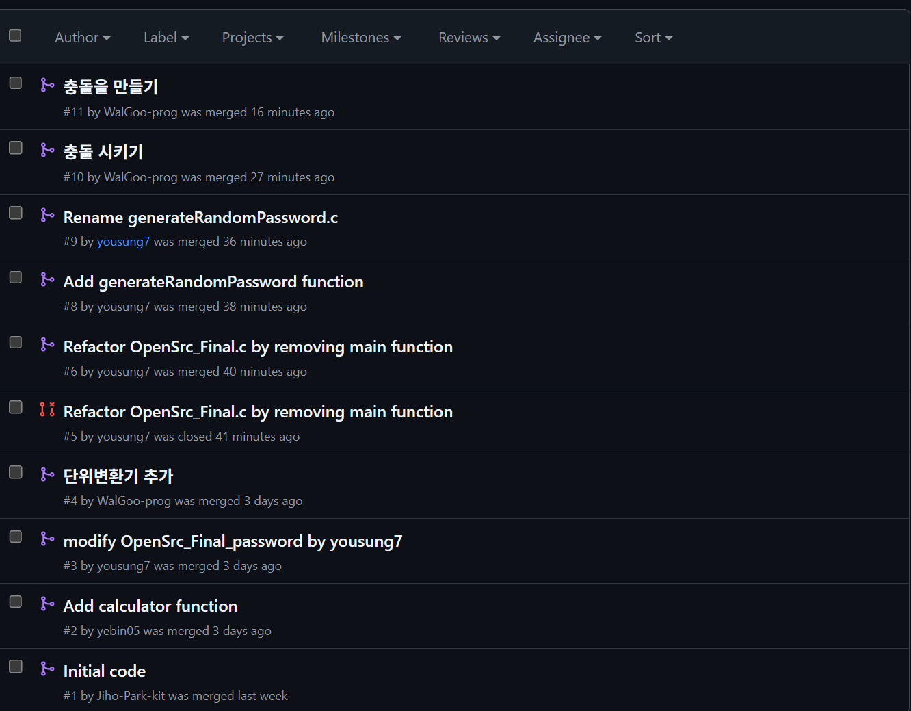
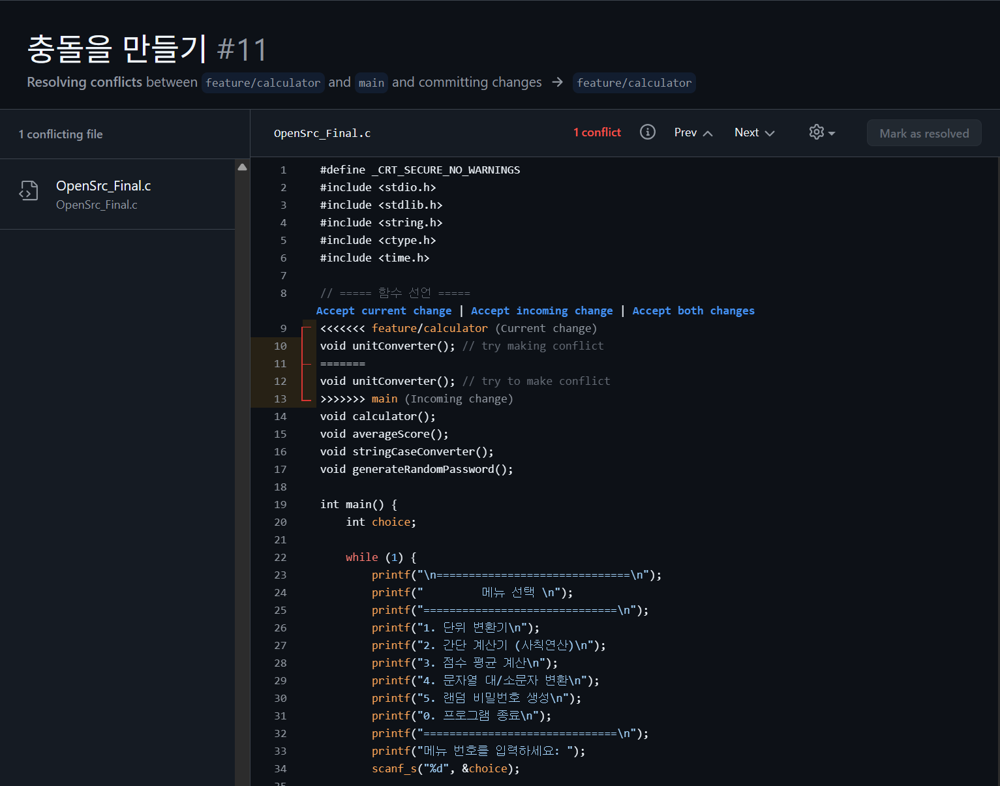
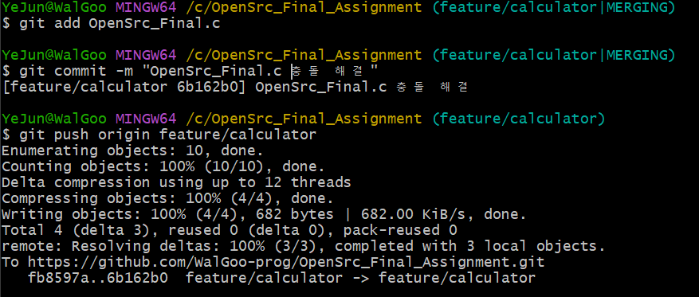

# OpenSrc_Final_Assignment

## 기능 소개

#### 1. 단위 변환기
#### 2. 계산기
#### 3. 비밀번호 생성기
#### 4. 점수 평균 계산기

## 각 기능 별 담당자

메인 프로그램(OpenSrc_Final.c) : 박지호
계산기(calculator.c) : 김예빈
비밀번호 생성기 : 김승기
문자열 처리기 : 정현민
단위 변환기, 충돌 처리 : 홍예준

## 실행 방법

OpenSrc_Final.c 실행 후 표시되는 옵션들의 입력으로 프로그램 실행

## Git 협업 기록

#### pr 기록

#### 충돌 결과

OpenSrc_Final.c 에서 충돌이 발생한 부분을 확인할 수 있음

따라서, feature/calculator 브랜치에서 최종적으로 충돌을 해결함

#### 충돌 해결

git bash 에서의 충돌 해결 후 정상적으로 push 및 pr 이 정상적으로 진행되었음

